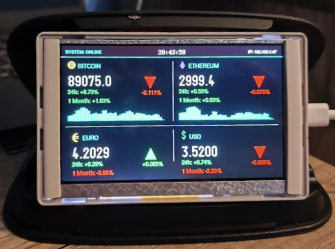
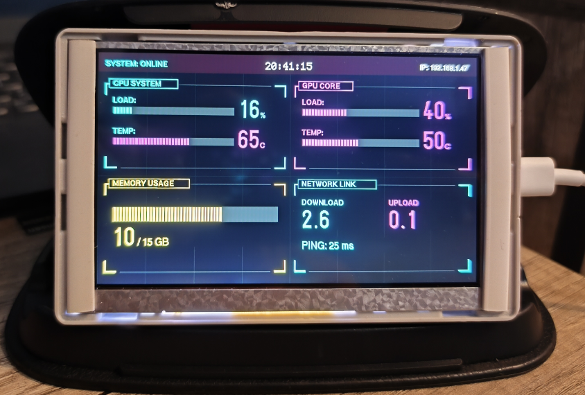
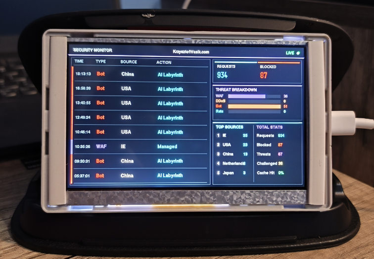
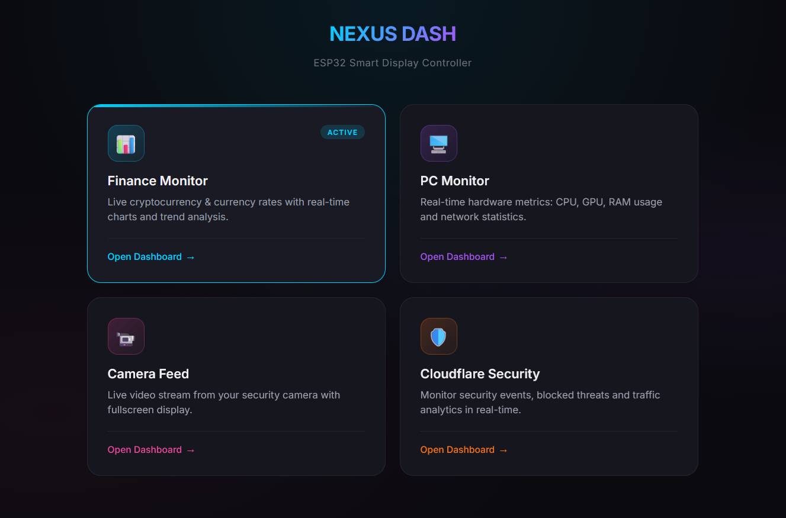
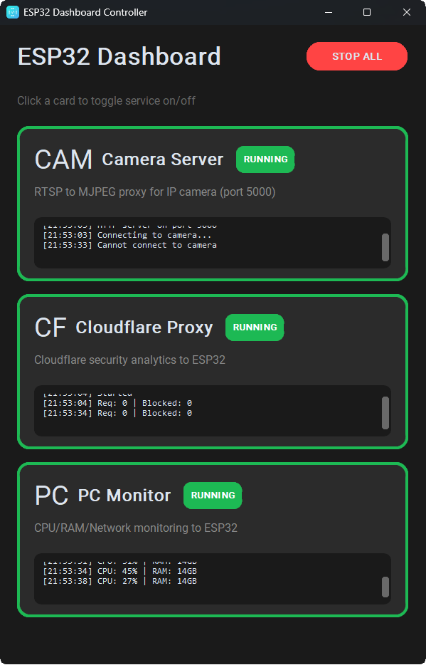

<div align="center">

# ESP32 Nexus Dash

### Multi-purpose Smart Display Dashboard for ESP32-S3

[](https://www.arduino.cc/)
[](https://www.espressif.com/)
[](https://isocpp.org/)
[](https://python.org/)

[Features](#features) • [Dashboards](#dashboards) • [Installation](#installation) • [Python Scripts](#python-companion-scripts) • [API](#api-reference)

</div>

---

## Features

- **4 Specialized Dashboards** — Finance, PC Monitor, Camera, and Cloudflare Security
- **Web Control Panel** — Beautiful responsive web interface for dashboard switching
- **Real-time Updates** — Live data refresh with minimal latency
- **Easy Integration** — REST API for pushing data from external sources
- **Dual-Core Processing** — Network tasks on Core 0, display rendering on Core 1
- **Python Companion Scripts** — Desktop controller app for PC monitoring and Cloudflare proxy

---

## Dashboards

<table>
  <tr>
    <td align="center" width="50%">
      
      <br/>
      <b>Finance Dashboard</b>
      <br/>
      <sub>Real-time cryptocurrency & currency rates with live charts</sub>
    </td>
    <td align="center" width="50%">
      
      <br/>
      <b>PC Monitor Dashboard</b>
      <br/>
      <sub>Hardware metrics: CPU, GPU, RAM & network statistics</sub>
    </td>
  </tr>
  <tr>
    <td align="center" width="50%">
      
      <br/>
      <b>Cloudflare Security Dashboard</b>
      <br/>
      <sub>Live security events, blocked threats & traffic analytics</sub>
    </td>
    <td align="center" width="50%">
      
      <br/>
      <b>Web Control Panel</b>
      <br/>
      <sub>Browser-based dashboard switcher</sub>
    </td>
  </tr>
</table>

---

## Dashboard Details

### Finance Dashboard
Track your favorite cryptocurrencies and currencies in real-time:
- **Bitcoin (BTC)** & **Ethereum (ETH)** prices from Binance API
- **EUR/PLN** & **USD/PLN** exchange rates
- **24h & 1-month price change** indicators
- **Live trend arrows** showing price direction
- **Historical price charts** with mountain visualization

### PC Monitor Dashboard
Monitor your computer's performance with a futuristic HUD interface:
- **CPU Load & Temperature** with segmented progress bars
- **GPU Load & Temperature** monitoring
- **RAM Usage** visualization
- **Network Statistics** — Download/Upload speeds & Ping
- *Requires Python companion script to push data*

### Camera Dashboard
Full-screen live video streaming:
- **MJPEG stream** from any IP camera
- **Direct frame rendering** to display
- **Fullscreen mode** for maximum visibility
- *Requires Python companion script for RTSP to MJPEG conversion*

### Cloudflare Security Dashboard
Real-time security monitoring for your websites:
- **Live security events** feed with threat types
- **Request & blocked count** statistics
- **Threat breakdown** by type (WAF, DDoS, Bot, Rate Limit)
- **Top source countries** ranking
- **Total stats** — Requests, Blocked, Threats, Challenged, Cache Hit %
- *Requires Python companion script to push Cloudflare analytics*

---

## Installation

### Hardware Requirements

This project is built for the **ESP32-S3-LCD-5B** development board with integrated 5" LCD display.

| Component | Specification |
|-----------|---------------|
| **Board** | ESP32-S3-LCD-5B (Waveshare or compatible) |
| **MCU** | ESP32-S3 |
| **Display** | 5" 1024x600 RGB LCD Panel |
| **Interface** | RGB Parallel (16-bit color) |

### Software Requirements

- [Arduino IDE](https://www.arduino.cc/en/software) 2.x or [PlatformIO](https://platformio.org/)
- ESP32 Arduino Core 2.0+

### Required Libraries

Install via Arduino Library Manager:

```
Arduino_GFX_Library
ArduinoJson
U8g2 (for fonts)
TJpg_Decoder
NTPClient
```

### Quick Start

1. **Clone the repository:**
   ```bash
   git clone https://github.com/yourusername/esp32-nexus-dash.git
   cd esp32-nexus-dash
   ```

2. **Configure WiFi credentials:**
   
   Rename `secrets.h.example` to `secrets.h` and edit:
   ```cpp
   #define WIFI_SSID "your-ssid"
   #define WIFI_PASSWORD "your-password"
   ```

3. **Configure Static IP (optional):**
   
   Edit `ESP32_Nexus_Dash.ino`:
   ```cpp
   IPAddress local_IP(192, 168, 1, 47);
   IPAddress gateway(192, 168, 1, 1);    
   IPAddress subnet(255, 255, 255, 0);
   ```

4. **Upload to ESP32:**
   - Select your ESP32-S3 board in Arduino IDE
   - Set partition scheme to "Huge APP (3MB No OTA)"
   - Upload!

---

## Python Companion Scripts

The `esp32_scripts.py` file provides a desktop GUI application that manages companion services for the ESP32 dashboard.
<div>
  
  <br/>
  <sub>Desktop controller app for managing ESP32 services</sub>
</div>

### Services Included

| Service | Description |
|---------|-------------|
| **PC Monitor** | Collects CPU, GPU, RAM, and network stats and pushes to ESP32 |
| **Cloudflare Proxy** | Fetches security analytics from Cloudflare API and pushes to ESP32 |
| **Camera Server** | Converts RTSP stream to MJPEG and serves on port 5000 |

### Python Requirements

```bash
pip install customtkinter psutil requests opencv-python flask WMI
```

### Hardware Monitoring (Optional)

For extended hardware monitoring (CPU/GPU temperature), run [OpenHardwareMonitor](https://openhardwaremonitor.org/) in the background.

### Configuration

Set environment variables before running:

```bash
# Windows PowerShell
$env:ESP32_IP = "192.168.1.47"
$env:CAMERA_IP = "192.168.1.13"
$env:CAMERA_USER = "admin"
$env:CAMERA_PASS = "your_password"
$env:CF_API_TOKEN = "your_cloudflare_token"
$env:CF_ZONE_ID = "your_zone_id"

# Linux/macOS
export ESP32_IP="192.168.1.47"
export CAMERA_IP="192.168.1.13"
export CAMERA_USER="admin"
export CAMERA_PASS="your_password"
export CF_API_TOKEN="your_cloudflare_token"
export CF_ZONE_ID="your_zone_id"
```

### Running the Script

```bash
python esp32_scripts.py
```

The GUI will start and automatically launch all services. Click cards to toggle individual services on/off.

---

## Configuration

### Display Pin Configuration

The default pinout for 1024x600 RGB display:

```cpp
#define TFT_DE    5
#define TFT_VSYNC 3
#define TFT_HSYNC 46
#define TFT_PCLK  7

// RGB Data pins
#define TFT_R0-R4  1, 2, 42, 41, 40
#define TFT_G0-G5  39, 0, 45, 48, 47, 21
#define TFT_B0-B4  14, 38, 18, 17, 10

// I2C (for touch if needed)
#define I2C_SDA 8
#define I2C_SCL 9
```

---

## API Reference

### Web Control Panel

Access the dashboard control panel at:
```
http://<ESP32_IP>/
```

### Dashboard Switch API

```http
GET /set?mode=<0-3>
```

| Mode | Dashboard |
|------|-----------|
| `0` | Finance |
| `1` | PC Monitor |
| `2` | Camera |
| `3` | Cloudflare Security |

### PC Monitor Data API

Push hardware stats to the display:

```http
POST /update_pc
Content-Type: application/json

{
  "cpu_load": 45,
  "cpu_temp": 65,
  "gpu_load": 80,
  "gpu_temp": 72,
  "ram_used": 12,
  "ram_total": 32,
  "net_down": 52.5,
  "net_up": 8.2,
  "ping": 25
}
```

### Cloudflare Security API

Push security analytics data:

```http
POST /update_cloudflare
Content-Type: application/json

{
  "total_requests": 125000,
  "blocked": 342,
  "challenged": 89,
  "threats": 127,
  "cache_hit": 94,
  "waf": 45,
  "ddos": 12,
  "bot": 89,
  "rate_limit": 23,
  "top_countries": [
    {"code": "US", "count": 234},
    {"code": "CN", "count": 156},
    {"code": "RU", "count": 98}
  ],
  "events": [
    {
      "time": "12:45:32",
      "type": "Bot",
      "country": "CN",
      "action": "block"
    }
  ]
}
```

---

## Project Structure

```
esp32-nexus-dash/
├── ESP32_Nexus_Dash/
│   ├── ESP32_Nexus_Dash.ino    # Main application
│   ├── DashboardFinance.h       # Finance dashboard
│   ├── DashboardPC.h            # PC monitor dashboard
│   ├── DashboardCamera.h        # Camera stream dashboard
│   ├── DashboardCloudflare.h    # Security dashboard
│   ├── WebInterface.h           # Web control panel
│   ├── FreeSansBold12pt7b.h     # Custom font
│   └── secrets.h                # WiFi credentials (not tracked)
├── esp32_scripts.py             # Python companion controller
├── images/                      # Dashboard screenshots
│   ├── finance_dashboard.png
│   ├── pc_dashboard.png
│   ├── security_dashboard.png
│   ├── web_dashboard.png
│   └── script_controller.png
└── README.md
```